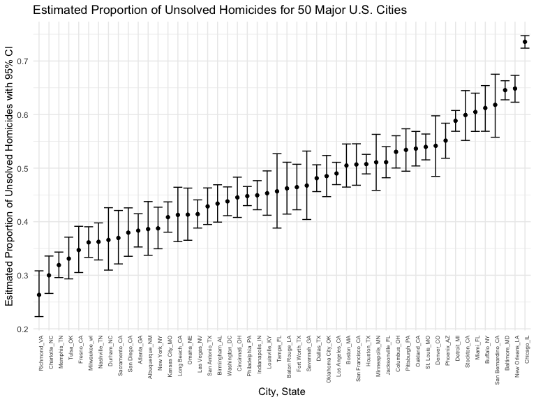
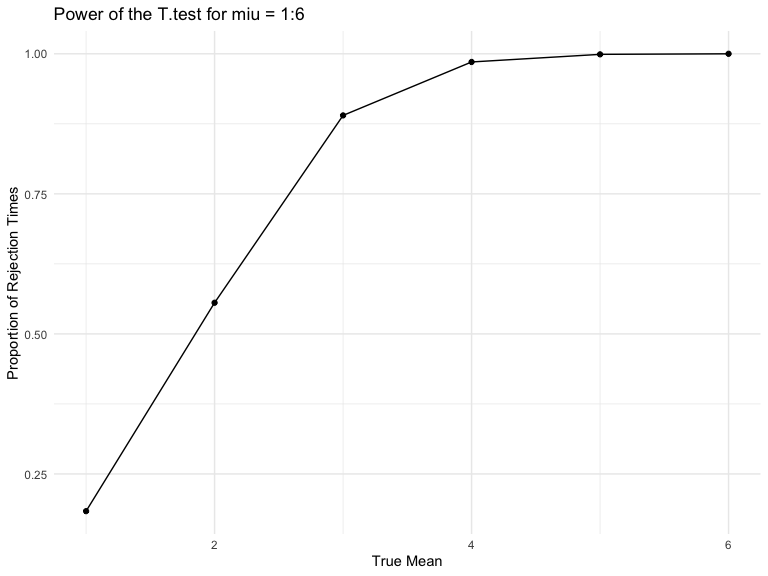
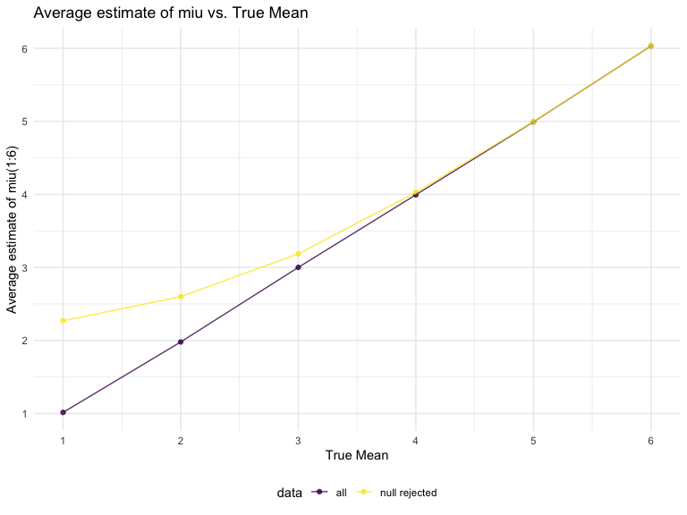

p8105_hw5_zc2691
================
Zhaohua Chunyu
2022-11-13

## Problem 2

``` r
homicide= read_csv("data/homicide-data.csv") 
```

    ## Rows: 52179 Columns: 12
    ## ── Column specification ────────────────────────────────────────────────────────
    ## Delimiter: ","
    ## chr (9): uid, victim_last, victim_first, victim_race, victim_age, victim_sex...
    ## dbl (3): reported_date, lat, lon
    ## 
    ## ℹ Use `spec()` to retrieve the full column specification for this data.
    ## ℹ Specify the column types or set `show_col_types = FALSE` to quiet this message.

`homicide` dataset includes 52179 rows of observations and 12 variables.
Key variables are homicide’s `uid`and `reported_date`, victim’s
information including his/her `last`/`first` name, `race`,`age`, `sex`,
variables describing the location where the homicide took place, such as
`city`,`state`, `lat`, `lon`, and the current `disposition` of the
homicide.

Create `city_state` and obtain the total number of homicides and the
number of unsolved homicides

``` r
homicide_df = 
  homicide %>% 
  mutate(city_state = str_c(city, "_", state)) %>% 
  filter(city_state != "Tulsa_AL")

homi_total = 
  homicide_df %>% 
  group_by(city_state) %>% 
  summarize(
    homi_total = n()
  ) 

homi_unsol = 
  homicide_df %>% 
  filter(disposition %in% c("Closed without arrest", "Open/No arrest")) %>% 
  group_by(city_state) %>% 
  summarize(
    homi_unsol = n()
  )
homicide_count = full_join(homi_unsol, homi_total) 
```

    ## Joining, by = "city_state"

Use the prop.test function to estimate the proportion of homicides that
are unsolved

``` r
balti_count = 
  homicide_count %>% 
  filter(city_state == "Baltimore_MD")

prop_test = 
  prop.test(
    x = balti_count %>% pull(homi_unsol), 
    n = balti_count %>% pull(homi_total)) 

prop_test_df = broom::tidy(prop_test)
prop_test_df %>% 
  select(estimate, conf.low, conf.high) 
```

    ## # A tibble: 1 × 3
    ##   estimate conf.low conf.high
    ##      <dbl>    <dbl>     <dbl>
    ## 1    0.646    0.628     0.663

Run prop.test for each of the cities in your dataset

``` r
prop = 
  function(homicide_count) {
    output =  
      prop.test(homicide_count %>% pull(homi_unsol), 
                homicide_count %>% pull(homi_total)) %>% 
      broom::tidy() %>% 
      select(estimate, conf.low, conf.high)
  }

homicide_count_nested = 
   homicide_count %>% 
  nest(data = homi_unsol:homi_total)

homicide_count_unnested = 
  homicide_count_nested %>% 
  mutate(
    prop_city = map(data, prop)) %>% 
  unnest(prop_city)
homicide_count_unnested
```

    ## # A tibble: 50 × 5
    ##    city_state     data             estimate conf.low conf.high
    ##    <chr>          <list>              <dbl>    <dbl>     <dbl>
    ##  1 Albuquerque_NM <tibble [1 × 2]>    0.386    0.337     0.438
    ##  2 Atlanta_GA     <tibble [1 × 2]>    0.383    0.353     0.415
    ##  3 Baltimore_MD   <tibble [1 × 2]>    0.646    0.628     0.663
    ##  4 Baton Rouge_LA <tibble [1 × 2]>    0.462    0.414     0.511
    ##  5 Birmingham_AL  <tibble [1 × 2]>    0.434    0.399     0.469
    ##  6 Boston_MA      <tibble [1 × 2]>    0.505    0.465     0.545
    ##  7 Buffalo_NY     <tibble [1 × 2]>    0.612    0.569     0.654
    ##  8 Charlotte_NC   <tibble [1 × 2]>    0.300    0.266     0.336
    ##  9 Chicago_IL     <tibble [1 × 2]>    0.736    0.724     0.747
    ## 10 Cincinnati_OH  <tibble [1 × 2]>    0.445    0.408     0.483
    ## # … with 40 more rows

Create a plot that shows the estimates and CIs for each city.

``` r
 homicide_count_unnested %>% 
  mutate(CI = conf.high - conf.low,
         city_state = fct_reorder(city_state, estimate)) %>% 
  ggplot(aes(x = city_state, y = estimate)) +
  geom_point() +
  geom_errorbar(aes(x = city_state, ymin = conf.low, ymax = conf.high))+
  theme(axis.text.x = element_text(angle = 90, hjust = 1, size = 6)) +
   labs(
    title = "Estimated Proportion of Unsolved Homicides for 50 Major U.S. Cities",
    x = "City, State",
    y = "Esitmated Proportion of Unsolved Homicides with 95% CI")
```



## Problem 3

Build a function of normal distribution that fixes n=30 and σ=5

``` r
sim_power = function(n = 30, miu, sigma = 5) {
  
  x = rnorm(n = n, mean = miu, sd = sigma)
  
  t_test = 
    t.test(x, miu = 0) %>% 
    broom::tidy()
  
  tibble(
    estimate_hat = t_test %>% pull(estimate),
    p_value = t_test %>% pull(p.value)
  )
}
```

Generate 5000 datasets from the model with μ = 0

``` r
sim_results_df = 
  expand_grid(
    true_mean = 0,
    iteration = 1:5000
  ) %>% 
  mutate(
    estimate_df = map(.x = true_mean, ~ sim_power(miu = .x))
  ) %>% 
  unnest(estimate_df)

sim_results_df
```

    ## # A tibble: 5,000 × 4
    ##    true_mean iteration estimate_hat p_value
    ##        <dbl>     <int>        <dbl>   <dbl>
    ##  1         0         1       0.616    0.480
    ##  2         0         2       0.843    0.348
    ##  3         0         3      -0.120    0.880
    ##  4         0         4       0.795    0.303
    ##  5         0         5       0.583    0.531
    ##  6         0         6      -1.18     0.208
    ##  7         0         7      -0.755    0.451
    ##  8         0         8      -0.0971   0.927
    ##  9         0         9      -0.849    0.253
    ## 10         0        10       0.125    0.913
    ## # … with 4,990 more rows

Generate 5000 datasets from the model with μ = 1:6

``` r
sim_results_df_2 = 
  expand_grid(
    true_mean = c(1:6),
    iteration = 1:5000
  ) %>% 
  mutate(
    estimate_df = map(.x = true_mean, ~ sim_power(miu = .x))
  ) %>% 
  unnest(estimate_df)

sim_results_df_2
```

    ## # A tibble: 30,000 × 4
    ##    true_mean iteration estimate_hat p_value
    ##        <int>     <int>        <dbl>   <dbl>
    ##  1         1         1        0.224  0.771 
    ##  2         1         2        0.744  0.350 
    ##  3         1         3        2.36   0.0164
    ##  4         1         4        0.851  0.370 
    ##  5         1         5        1.84   0.0710
    ##  6         1         6        1.90   0.0376
    ##  7         1         7        2.03   0.0453
    ##  8         1         8        1.13   0.109 
    ##  9         1         9        1.11   0.141 
    ## 10         1        10        1.12   0.237 
    ## # … with 29,990 more rows

Make a plot showing the proportion of times the null was rejected (the
power of the test) on the y axis and the true value of μ on the x axis.

``` r
sim_results_df_2 = 
  sim_results_df_2 %>% 
  mutate(
    result = case_when(
    p_value < 0.05 ~ "reject null",
    p_value >= 0.05  ~ "fail to reject")) 
  
sim_results_df_2 %>%  
  group_by(true_mean) %>%
  filter(result == "reject null") %>% 
  summarize(n_obs = n()) %>% 
  mutate(reject_prop = n_obs / 5000) %>% 
  ggplot(aes(x = true_mean, y = reject_prop)) +
  geom_point() +
  geom_path() +
  labs(
    title = "Power of the T.test for miu = 1:6",
    x = "True Mean",
    y = "Proportion of Rejection Times")
```



Describe the association between effect size and power:

The statistical power depends on effect size. The effect size is
calculated by dividing the difference between the true mean and
estimated miu by sd. Therefore, the effect size increases as the true
mean increases while sd is constant. Effect size tells you how
meaningful the relationship between variables or the difference between
groups is. As effect size increases, the power of the t-test increases.
The power approaches 1 as the true mean increases.

Make a plot showing the average estimate of miu on the y axis and the
true value of miu on the x axis. Make a second plot the average estimate
of miu only in samples for which the null was rejected on the y axis and
the true value of μ on the x axis.

``` r
sim_average_total = 
  sim_results_df_2 %>%
  group_by(true_mean) %>% 
  summarize(estimate_avg = mean(estimate_hat)) %>% 
  mutate(data = "all")

sim_average_reject = 
  sim_results_df_2 %>%
  filter(result == "reject null") %>% 
  group_by(true_mean) %>% 
  summarize(estimate_avg = mean(estimate_hat)) %>% 
  mutate(data = "null rejected")

sim_average = bind_rows(sim_average_total, sim_average_reject)

sim_average %>% 
ggplot(aes(x = true_mean, y = estimate_avg, color = data)) +
  geom_point(alpha = 0.8) + 
  geom_path(alpha = 0.8) +
  scale_x_continuous( breaks = 1:6 )+
  scale_y_continuous( breaks = 1:6 )+
  labs(
    title = "Average estimate of miu vs. True Mean",
    x = "True Mean",
    y = "Average estimate of miu(1:6)"
  ) + 
  theme(legend.position = "bottom")
```



Based on the plot, the sample average of μ̂ across tests for which the
null is rejected is approximately equal to the true value of μ when the
true mean is greater than or equal to 4. With smaller true mean values,
the average estimate of miu is slightly larger than the true mean.
